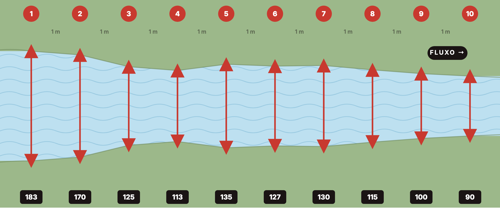
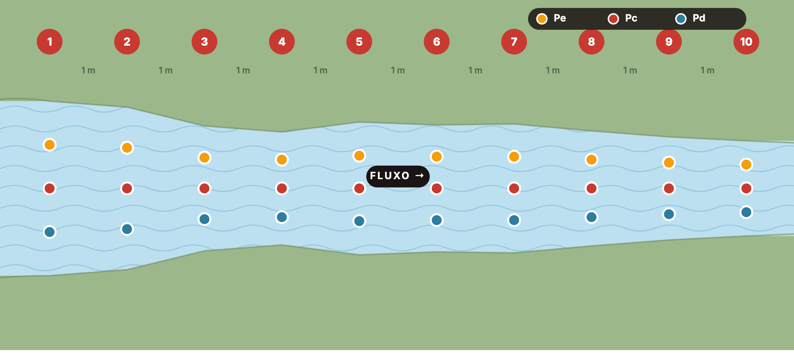
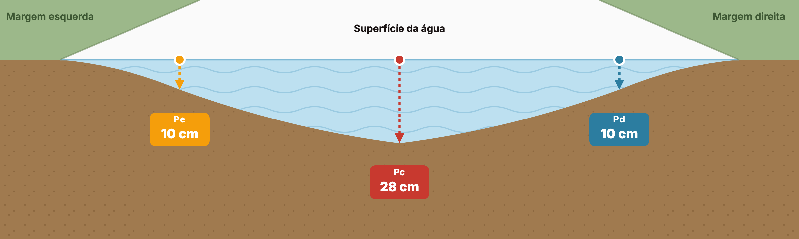
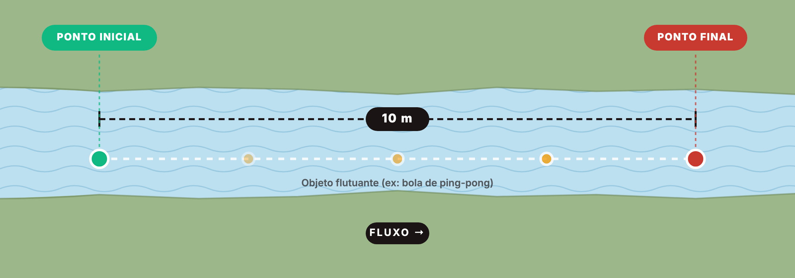
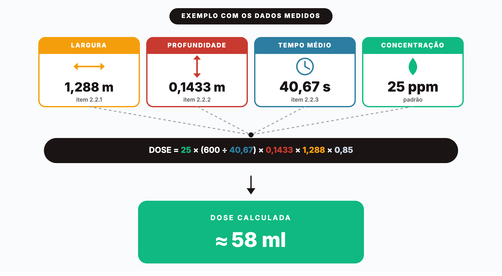

# Avaliação de Pontos do Controle Larval

**Versão 05**

| | |
|---|---|
| Pregão Eletrônico | 590/2023 |
| Termo de Contrato | 650/2024 |

**Município de Joinville**
Secretaria de Meio Ambiente

Abril / 2026

---

## Sumário

1. Introdução
2. Metodologia para Determinação de Pontos
   - 2.1 Levantamento e avaliação de campo
   - 2.2 Medição de Vazão
     - 2.2.1 Determinação da largura média
     - 2.2.2 Determinação da profundidade média
     - 2.2.3 Velocidade superficial
     - 2.2.4 Dimensionamento da dose de larvicida
   - 2.3 Identificação dos Pontos
3. Execução das Medições de Vazão em Campo
   - 3.1 Considerações iniciais
   - 3.2 Regiões contempladas
   - 3.3 Pontos com medição direta de vazão
   - 3.4 Apresentação dos pontos sem medição de vazão
   - 3.5 Comprovação técnica e atualizações futuras

---

## 1. Introdução

A avaliação dos pontos de controle larval constitui uma etapa fundamental no manejo de simulídeos (borrachudos), uma vez que permite definir, com precisão técnica, os locais estratégicos para aplicação do larvicida biológico, visando a máxima eficiência no controle das formas imaturas (larvas).

Esse processo tem como principal objetivo identificar, ajustar e validar os pontos de intervenção ao longo dos cursos d'água, garantindo que o produto seja adequadamente distribuído e alcance as áreas com presença de larvas, considerando as características hídricas e ambientais de cada trecho.

A definição dos pontos de controle deve levar em consideração, de forma integrada, a presença de insetos adultos na área e a ocorrência de formas imaturas (larvas) nos criadouros, permitindo correlacionar os focos de infestação com os locais de desenvolvimento do vetor.

A avaliação contempla, de forma técnica, os seguintes aspectos:

- Análise e definição dos pontos de aplicação, incluindo a possibilidade de realocação de pontos existentes ou implantação de novos pontos, conforme as condições observadas em campo;
- Determinação da vazão dos cursos d'água, parâmetro essencial para o dimensionamento da dose de larvicida a ser aplicada.

A execução adequada dessas atividades é determinante para a eficiência do tratamento, pois influencia diretamente a dispersão do produto, o alcance da aplicação e a efetividade no controle das larvas. Além disso, contribui para a otimização dos recursos operacionais e para a sustentabilidade das ações de controle, reduzindo desperdícios e minimizando impactos ambientais.

---

## 2. Metodologia para Determinação de Pontos

A metodologia adotada para a avaliação dos pontos de controle larval de simulídeos baseia-se em procedimentos técnicos de campo voltados à identificação, caracterização e dimensionamento dos locais de aplicação do larvicida biológico.

As atividades são realizadas diretamente nos cursos d'água, considerando suas características hídricas, ambientais e biológicas, com o objetivo de garantir maior precisão na definição dos pontos e na eficiência do controle.

A metodologia compreende as seguintes etapas:

### 2.1 Levantamento e avaliação de campo

Consiste na inspeção detalhada dos cursos d'água, com foco na identificação de áreas com presença de larvas e na verificação da ocorrência de insetos adultos nas proximidades.

Durante essa etapa, são avaliados:

- Presença e intensidade de infestação larval;
- Ocorrência de insetos adultos na área;
- Características do curso d'água (largura, profundidade, velocidade aparente da corrente);
- Presença de substratos favoráveis ao desenvolvimento larval (rochas, vegetação, galhos e materiais submersos);
- Condições hídricas do trecho (turbulência, remansos, obstáculos e acúmulo de matéria orgânica).

Com base nessas informações, são definidos, ajustados ou implantados novos pontos de aplicação, visando garantir cobertura adequada das áreas infestadas.

### 2.2 Medição de Vazão

Quando há necessidade de abertura de novos pontos em áreas ainda não contempladas pelo Programa de Controle de Simulídeos, a determinação da vazão do curso d'água constitui etapa fundamental para o correto dimensionamento da dose de larvicida a ser aplicada.

Sempre que houver acesso seguro e condições adequadas de campo, a vazão de rios, córregos ou canais deve ser estimada por meio da medição direta de parâmetros hídricos básicos, sendo esta a metodologia recomendada para garantir maior precisão nos cálculos e na eficiência da aplicação.

A vazão é determinada a partir da multiplicação de quatro parâmetros: largura média do canal, profundidade média da lâmina d'água, velocidade superficial da corrente e um coeficiente de correção, conforme a seguinte expressão:

> **Q = L × P × Vs × C**
>
> - **Q** = vazão (m³/s)
> - **L** = largura média do curso d'água (m)
> - **P** = profundidade média (m)
> - **Vs** = velocidade superficial da água (m/s)
> - **C** = coeficiente de correção (adimensional, tipicamente 0,85 para leitos naturais)

O **coeficiente de correção (C)** é aplicado para converter a velocidade superficial — medida pelo método do flutuador — em **velocidade média ao longo da seção transversal** do curso d'água. Como o atrito com o leito e as margens faz com que a água do fundo e das laterais escoe mais lentamente que a da superfície, a velocidade superficial é sempre maior que a velocidade média efetiva. O coeficiente, geralmente situado entre 0,80 e 0,90, ajusta essa diferença, sendo o valor de **0,85** amplamente adotado em programas de controle de simulídeos para leitos naturais com características hidráulicas regulares.

A aplicação dessa metodologia permite estimar o volume de água que escoa no trecho avaliado em determinado intervalo de tempo, sendo um parâmetro essencial para o cálculo da dosagem adequada do larvicida. Dessa forma, garante-se maior eficiência no tratamento, melhor dispersão do produto e cobertura adequada das áreas com presença de larvas.

Em situações específicas onde a medição direta não possa ser realizada de forma segura ou operacionalmente viável, o dimensionamento da dose poderá ser definido com base em critérios técnicos empíricos. Nesses casos, a estimativa considera a experiência do profissional responsável, associada à avaliação visual das características do curso d'água, tais como largura aparente, velocidade da corrente, presença de matéria orgânica, nível de infestação e comportamento hídrico do trecho (turbulência, remansos e obstáculos).

Ainda que essa abordagem seja aplicada em campo, recomenda-se que seja utilizada de forma excepcional, sendo sempre acompanhada de monitoramento posterior, com o objetivo de validar a eficácia do tratamento e permitir ajustes nas aplicações subsequentes.

#### 2.2.1 Determinação da largura média

A determinação da largura média do curso d'água deve ser realizada por meio de medições sucessivas ao longo de um trecho representativo, preferencialmente com extensão de 10 metros.

Para isso, recomenda-se medir a largura do córrego em intervalos regulares de 1 metro, totalizando múltiplos pontos de amostragem ao longo do trecho selecionado. Essas medições devem ser realizadas de margem a margem, em seções perpendiculares ao fluxo da água, buscando representar fielmente as variações do canal.

Após a coleta dos dados, os valores obtidos devem ser somados e divididos pelo número total de medições realizadas, resultando na largura média do curso d'água, expressa em metros.

Esse parâmetro é fundamental para o cálculo da vazão, sendo diretamente proporcional ao volume de água transportado no trecho avaliado e, consequentemente, ao dimensionamento da dose de larvicida a ser aplicada.

**Exemplo de cálculo:**

- Larguras medidas (cm): 183, 170, 125, 113, 135, 127, 130, 115, 100, 90
- Soma: 1.288 cm
- Média: 1.288 ÷ 10 = 128,8 cm = **1,288 m**

*Figura 1 — Determinação da largura média: 10 medições perpendiculares ao fluxo, espaçadas a cada 1 metro. Larguras expressas em centímetros.*

#### 2.2.2 Determinação da profundidade média

A profundidade média do curso d'água deve ser determinada no mesmo trecho utilizado para a medição da largura, garantindo a consistência dos dados hídricos.

Para cada seção de largura previamente definida (a cada 1 metro ao longo do trecho), devem ser realizadas medições de profundidade em três pontos distintos: próximo à margem esquerda, no centro do canal e próximo à margem direita. Essa distribuição permite representar de forma mais fiel as variações do leito do curso d'água.

As medições devem ser executadas de maneira uniforme ao longo de todas as seções, contemplando tanto regiões mais rasas quanto mais profundas, evitando distorções no resultado final.

Após a coleta dos dados, todos os valores de profundidade obtidos devem ser somados e divididos pelo número total de medições realizadas, resultando na profundidade média do curso d'água, expressa em metros.

Esse parâmetro, associado à largura média e à velocidade da corrente, é fundamental para o cálculo da vazão e, consequentemente, para o correto dimensionamento da dose de larvicida a ser aplicada.

*Vista em corte (seção transversal) — exemplo da seção 4:*

**Exemplo de cálculo:**

- Soma das profundidades: Σ Pe (107 cm) + Σ Pc (219 cm) + Σ Pd (104 cm) = 430 cm
- Média: 430 ÷ 30 medições = 14,33 cm = **0,1433 m**

*Figura 2 — Determinação da profundidade média: 3 medições por seção (esquerda, centro, direita) ao longo de 10 seções, totalizando 30 pontos. Profundidades expressas em centímetros.*

#### 2.2.3 Velocidade superficial

A velocidade superficial do curso d'água deve ser determinada no mesmo trecho onde foram realizadas as medições de largura e profundidade médias, garantindo a representatividade dos dados utilizados no cálculo da vazão.

Para essa medição, utiliza-se um objeto flutuante (como uma esfera parcialmente preenchida, por exemplo, uma bola de ping-pong ou similar), que deve ser lançado na correnteza em um ponto inicial previamente definido.

Em seguida, mede-se o tempo necessário para que o objeto percorra uma distância conhecida, recomendando-se um trecho de 10 metros com fluxo relativamente homogêneo. Esse procedimento deve ser repetido mais de uma vez, a fim de reduzir possíveis interferências e obter maior confiabilidade nos resultados.

A velocidade superficial é então determinada pela relação entre a distância percorrida e o tempo médio obtido nas medições, conforme a expressão:

> **Vs = D / T**
>
> - **Vs** = velocidade superficial da água (m/s)
> - **D** = distância percorrida (m)
> - **T** = tempo médio de deslocamento (s)

A correta determinação da velocidade é fundamental para o cálculo da vazão, influenciando diretamente o dimensionamento da dose de larvicida e a eficiência da aplicação.

**Exemplo de cálculo:**

- Tentativas: T₁ = 39 s · T₂ = 43 s · T₃ = 40 s
- Tempo médio: (39 + 43 + 40) ÷ 3 = **40,67 s**
- Velocidade: Vs = 10 ÷ 40,67 = **0,25 m/s**

*Figura 3 — Determinação da velocidade superficial: cronometragem do tempo que o flutuador percorre uma distância conhecida (10 m). O procedimento é repetido ao menos 3 vezes para obter o tempo médio.*

#### 2.2.4 Dimensionamento da dose de larvicida

O dimensionamento da dose de VectoBac® 12AS para o controle de simulídeos é realizado com base nos dados obtidos em campo, sendo utilizado, como ferramenta de apoio, planilha técnica fornecida pelo fabricante do produto. Essa planilha automatiza o cálculo da dose a partir dos parâmetros hídricos medidos, garantindo maior padronização e confiabilidade nos resultados.

O cálculo da dose é fundamentado nas medições de largura média, profundidade média, tempo de escoamento da água e no mesmo coeficiente de correção utilizado no cálculo da vazão, seguindo a seguinte expressão:

> **DOSE = PPM × (600 / TEMPO) × PROFUNDIDADE × LARGURA × C**
>
> - **PPM** = concentração padrão do produto (25 ppm)
> - **TEMPO** = tempo médio de deslocamento do flutuador (em segundos)
> - **LARGURA** = largura média do curso d'água (m)
> - **PROFUNDIDADE** = profundidade média do curso d'água (m)
> - **C** = coeficiente de correção (adimensional, tipicamente 0,85)

O coeficiente de correção (C) é mantido no cálculo da dose pelas mesmas razões descritas no item 2.2: como o termo *(600 / TEMPO)* é derivado da velocidade superficial do flutuador, sua aplicação direta superestimaria o volume de água efetivamente escoado na seção. A inclusão de C garante a coerência entre o dimensionamento da dose e a vazão real do trecho, evitando subdosagem ou desperdício de produto.

A concentração de **25 ppm** é adotada como padrão no dimensionamento da dose para a aplicação de VectoBac® 12AS no controle de simulídeos, parâmetro consolidado pela planilha técnica do fabricante. Aplicando a fórmula com os dados medidos nas seções 2.2.1, 2.2.2 e 2.2.3 (L = 1,288 m; P = 0,1433 m; T = 40,67 s), obtém-se a dose detalhada a seguir:

*Figura 4 — Exemplo do dimensionamento da dose com os dados medidos nas seções 2.2.1, 2.2.2 e 2.2.3. Para um trecho com largura média de 1,288 m, profundidade média de 0,1433 m e tempo médio de 40,67 s, à concentração padrão de 25 ppm, a dose calculada de VectoBac® 12AS é de aproximadamente **58 ml** para o trecho avaliado, em conformidade com a planilha técnica do fabricante.*

> **⚠ Observação técnica**
>
> Em situações nas quais não seja possível realizar a medição direta da vazão do curso d'água — seja por limitações de acesso, segurança ou condições operacionais — o dimensionamento da dose do larvicida deve ser realizado com base em critérios técnicos empíricos.
>
> Nesses casos, a definição da dosagem é conduzida pelo profissional responsável, considerando sua experiência de campo e a avaliação visual das características do trecho, tais como largura aparente do canal, profundidade estimada, velocidade perceptível da corrente, presença de matéria orgânica em suspensão, nível de infestação larval e condições hídricas (turbulência, remansos e obstáculos).
>
> Essa abordagem, embora menos precisa do que a medição direta, é amplamente empregada em programas de controle em áreas de difícil acesso, permitindo a continuidade das ações operacionais.
>
> Ressalta-se que, nessas situações, é indispensável a realização de monitoramento posterior, com o objetivo de avaliar a eficácia do tratamento e promover ajustes nas doses e nos pontos de aplicação em intervenções subsequentes, garantindo a efetividade do controle.

### 2.3 Identificação dos Pontos

Após a definição dos pontos de aplicação e o dimensionamento da dose de larvicida a ser utilizada em cada local, procede-se à identificação física dos pontos em campo, com o objetivo de garantir sua correta localização, padronização das aplicações e rastreabilidade das intervenções.

A identificação é realizada por meio da instalação de marcos visuais no local, como placas fixas, devidamente posicionadas em áreas de fácil visualização e acesso. Essas identificações devem conter informações essenciais, como código do ponto.

Paralelamente, cada ponto deve estar vinculado a uma ficha de controle, na qual são registradas todas as informações operacionais como: dose aplicada, datas de aplicação.

Esse procedimento permite:

- Padronizar as operações de campo;
- Facilitar a localização dos pontos pelas equipes;
- Garantir a continuidade das ações ao longo do tempo;
- Possibilitar o monitoramento e a avaliação da eficácia do controle.

A correta identificação dos pontos é fundamental para assegurar a organização do programa, reduzir falhas operacionais e garantir maior eficiência nas aplicações de larvicida.

---

## 3. Execução das Medições de Vazão em Campo

### 3.1 Considerações iniciais

A execução das medições de vazão dos cursos d'água foi realizada conforme metodologia descrita nos itens 2.2.1 a 2.2.4 deste relatório, contemplando os pontos onde é realizada a aplicação do larvicida biológico, distribuídos nas diferentes regiões do município de Joinville.

As atividades de campo foram conduzidas observando as condições hídricas e ambientais de cada ponto de aplicação, priorizando a segurança operacional e a representatividade dos dados coletados. Em locais onde foi possível executar a medição direta, todos os parâmetros hídricos (largura média, profundidade média, velocidade superficial e tempo de escoamento) foram registrados conforme a metodologia técnica adotada. Nos demais locais, em que as condições de campo inviabilizaram a medição direta, foi realizado o registro fotográfico documental e o dimensionamento da dose conduzido com base em critérios técnicos empíricos, conforme previsto na Observação Técnica do item 2.2.4.

### 3.2 Regiões contempladas

As medições e os registros foram organizados por região, conforme distribuição geográfica dos pontos de aplicação:

**Rio do Júlio**
Medição de vazão nos cursos hídricos com pontos de aplicação distribuídos ao longo das estradas da região.

**Dona Francisca**
Medição de vazão nos cursos hídricos com pontos de aplicação da Estrada Tia Marta e demais estradas da região, contemplando os cursos hídricos principais.

**Região Urbana**
Medição de vazão nos pontos de aplicação localizados no Parque Zoobotânico.

### 3.3 Pontos com medição direta de vazão

Nos pontos de aplicação em que houve volume de água corrente suficiente e condições adequadas de acesso, foram executadas as medições de vazão pela metodologia descrita nos itens 2.2.1 a 2.2.3, com posterior dimensionamento da dose de larvicida conforme item 2.2.4.

Para cada ponto avaliado, são apresentados os seguintes dados consolidados:

**Parâmetros hídricos calculados**

- Vazão (m³/s);
- Largura média (m);
- Profundidade média (m);
- Velocidade superficial (m/s);
- Dose calculada de larvicida (ml).

**Dados brutos das medições de campo**

- Larguras medidas a cada 1 metro ao longo do trecho (cm);
- Profundidades medidas em três pontos por seção — margem esquerda, centro e margem direita (cm);
- Tempos cronometrados nas repetições da medição de velocidade superficial (s).

A apresentação dos dados brutos juntamente com os parâmetros calculados garante total transparência e rastreabilidade dos cálculos, permitindo a verificação técnica de cada medição apresentada.

### 3.4 Apresentação dos pontos sem medição de vazão

Para cada ponto sem medição direta de vazão, são apresentados nos anexos os seguintes dados:

**Dados cadastrais do ponto**

- Código de identificação do ponto;
- Região, estrada e cidade;
- Cliente vinculado;
- Coordenadas geográficas cadastrais;
- Volume atual de larvicida aplicado (ml).

**Registro fotográfico georreferenciado**

- Data e hora da captura (formato AAAA:MM:DD HH:MM:SS);
- Coordenadas geográficas (GPS — latitude e longitude) extraídas dos metadados EXIF;
- Imagem do ponto avaliado, comprovando as condições encontradas em campo.

### 3.5 Comprovação técnica e atualizações futuras

Os registros apresentados nos anexos deste relatório representam as medições e avaliações executadas até a presente data, organizadas por região e ponto de aplicação. As demais regiões do município poderão ser contempladas em medições futuras, conforme cronograma operacional e disponibilidade de condições adequadas de campo.

Considerando o caráter dinâmico do programa de controle de simulídeos e a possibilidade de execução de novas medições, a relação de pontos apresentada neste relatório poderá ser atualizada e complementada em entregas futuras, mantendo-se o mesmo padrão técnico de apresentação:

- Para pontos com medição direta de vazão: parâmetros hídricos calculados, dados brutos das medições de campo e registro fotográfico georreferenciado;
- Para pontos sem medição direta: dados cadastrais e registro fotográfico documental georreferenciado.

Esta estrutura padronizada garante a rastreabilidade e a comprovação técnica do serviço executado, tanto nas medições já realizadas quanto nas que vierem a ser incorporadas em atualizações posteriores deste produto.

---

## Assinaturas

Joinville, 29 de abril de 2026.

________________________________
**Osmar Adelino de Aviz**
Administrador

________________________________
**Eder Corbari**
Eng. Ambiental — CRQ 13302332

---

## Anexos

Os anexos contêm os registros de medição por ponto e região, conforme estrutura técnica descrita nos itens 3.3 e 3.4. Material complementar disponibilizado em entregas futuras conforme cronograma.
